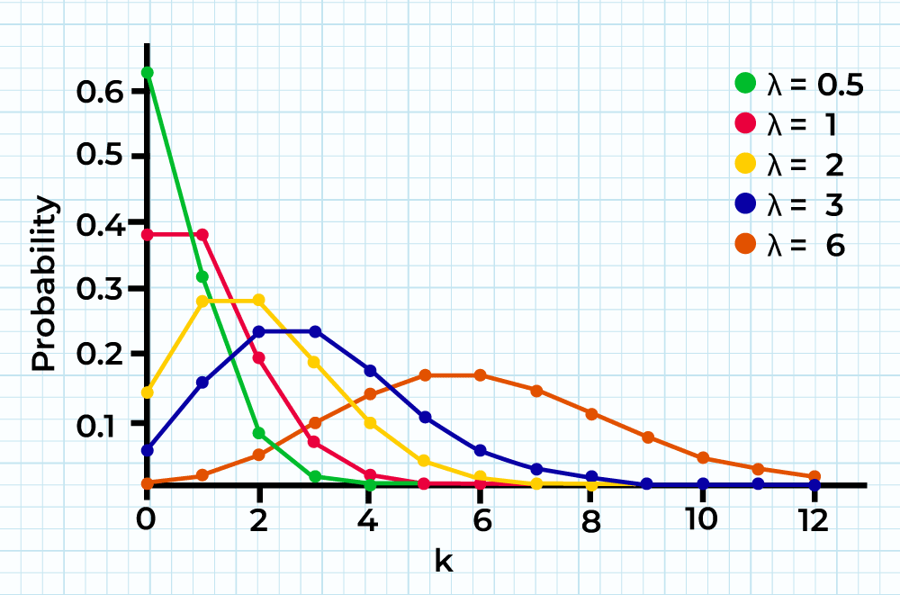

Set working directory to R code folder

```{r}
setwd("C:/Users/q4q/repos/DSE511_Final_Project/Step 3. Cluster Analysis/R Code")
```

Load necessary libraries

```{r}
library(readr)
library(tidyverse)
library(fitdistrplus)
library(MASS)
```

Import dataset from Step 1. Data Cleaning

```{r}
clean_df <- read_csv("C:/Users/q4q/repos/DSE511_Final_Project/Step 1. Data Cleaning/R code/outbreak_clean_r_v2.csv")

head(clean_df)
```

## Distribution Function of Numeric Variables

Before conducting a cluster analysis, we first need to determine the distribution function of the numeric variables which will be used in the cluster analysis. This will govern what type of cluster analysis we will perform.

From Step. 2 Exploratory Data Analysis in R, we observed the numeric variables and their log-transformations were not normally distributed. Thus, we will explore other distribution functions to fit the numeric variables.

### I. Poisson Distribution for Count Data

Poisson distribution function is suitable for count data (non-negative integers with variance ≈ mean) because it uses a log-link function to account for the logarithmic distribution of variables. We will only be fitting a Poisson to Illnesses, Hospitalizations, and Deaths (not ratios).

The Poisson distribution function is defined by one parameter called lambda,as shown below by Geeks for Geeks:



Since the Poisson distribution lies on the assumption that **mean = variance**

```{r}
mean(clean_df$Illnesses)
var(clean_df$Illnesses)

mean(clean_df$Hospitalizations)
var(clean_df$Hospitalizations)

mean(clean_df$Deaths)
var(clean_df$Deaths)
```

The only variable that looks like the mean is somewhat equal to variance is deaths, but not hospitalizations and illnesses. We'll still find their lambdas and plot them to see if it's still possible to fit the Poisson distribution to them.

**Lambda calculations**

```{r}
# Fit poisson distribution to variables
ill_pois <- fitdistr(clean_df$Illnesses, "poisson")
hosp_pois <- fitdistr(clean_df$Hospitalizations, "poisson")
death_pois <- fitdistr(clean_df$Deaths, "poisson")

# Extract lambdas
ill_lambda <- ill_pois$estimate["lambda"]
hosp_lambda <- hosp_pois$estimate["lambda"]
death_lambda <- death_pois$estimate["lambda"]

# View
ill_lambda
hosp_lambda
death_lambda
```

These lambdas indicate the average count of these variables. Therefore, the average outbreak results in 33 illnesses, 0.72 hospitalizations, and 0.037 deaths.

Plot the fitted Poisson distribution to the histogram of each count variable

1.  Illnesses

```{r}
# Plot the histogram 
hist(clean_df$Illnesses, 
     freq = FALSE,                   #freq = FALSE for density
     main = "Poisson Distribution of Illnesses (lambda = 33.6)",
     xlab = "Number of Events", 
     ylab = "Density")

# Overlay discrete Poisson probabilities
x_vals <- 0:max(clean_df$Illnesses)
points(x_vals, dpois(x_vals, ill_lambda), col = "red", pch = 16)
lines(x_vals, dpois(x_vals, ill_lambda), col = "red", lwd = 2)
```

2.  Hospitalizations

```{r}
# Plot the histogram 
hist(clean_df$Hospitalizations, 
     freq = FALSE,                   #freq = FALSE for density
     main = "Poisson Distribution of Hospitalizations (lambda = 0.720)",
     xlab = "Number of Events", 
     ylab = "Density")

# Overlay discrete Poisson probabilities
x_vals <- 0:max(clean_df$Hospitalizations)
points(x_vals, dpois(x_vals, hosp_lambda), col = "red", pch = 16)
lines(x_vals, dpois(x_vals, hosp_lambda), col = "red", lwd = 2)
```

2.  Deaths

```{r}
# Plot the histogram 
hist(clean_df$Deaths, 
     freq = FALSE,                   #freq = FALSE for density
     main = "Poisson Distribution of Deaths (lambda = 0.0373)",
     xlab = "Number of Events", 
     ylab = "Density")

# Overlay discrete Poisson probabilities
x_vals <- 0:max(clean_df$Deaths)
points(x_vals, dpois(x_vals, death_lambda), col = "red", pch = 16)
lines(x_vals, dpois(x_vals, death_lambda), col = "red", lwd = 2)
```

The Poisson distribution only seems fit for the variable Deaths.

Let's consider other distributions

### II. Negative Binomial

```{r}

ill_nb <- fitdistr(clean_df$Illnesses, densfun = "negative binomial")
ill_nb
```

### II. Beta Distribution for Ratio Variables

```{r}

```

### III. Normal Distribution for Standardized Count Data

```{r}
ill_hist <- hist(clean_df$Illnesses_std)
hosp_hist <- hist(clean_df$Hospitalizations_std)
death_hist <- hist(clean_df$Deaths_std)
```

These don't look normally distributed either

## Principal Component Analysis

Before conduct a cluster analysis, we need to determine the number of clusters by looking a scree plot of the PCA.

## Cluster Analysis

### I. Distance-based clustering methods

#### a. Hierarchical Clustering

-   This method builds a hierarchy of clusters, represented by a dendrogram. You can choose different linkage methods (e.g., single, complete, average, Ward's) and distance metrics (e.g., Euclidean, Manhattan, Jaccard for binary data).

However, R could not handle conducting this clustering method on all the data (said it was too big)

```{r}
# Isolate standardized numeric variables for cluster analysis
num_vars <- clean_df %>%
  dplyr::select(
    Illnesses_std,
    Hospitalizations_std,
    Deaths_std,
    Hosp_per_ill,
    Death_per_ill
  )

# Calculate distance matrix
dist_matrix <- dist(num_vars, method = "euclidean") 

# Perform hierarchical clustering
hc_result <- hclust(dist_matrix, method = "ward.D2")

# Cut the dendrogram to get clusters
clusters <- cutree(hc_result, k = 3) 
```

### II. Other Clustering Methods

#### a. K-means

```{r}
set.seed(123)

k <- 4  # choose a starting number of clusters
kmeans_result <- kmeans(num_vars, centers = k, nstart = 25)

# Attach cluster labels back to your data
clean_df$kmeans_cluster <- kmeans_result$cluster

```

Inspect

```{r}
table(clean_df$kmeans_cluster)

clean_df %>%
  group_by(kmeans_cluster) %>%
  summarise(
    mean_ill = mean(Illnesses_std),
    mean_hosp = mean(Hospitalizations_std),
    mean_death = mean(Deaths_std),
    .groups = "drop"
  )
```
